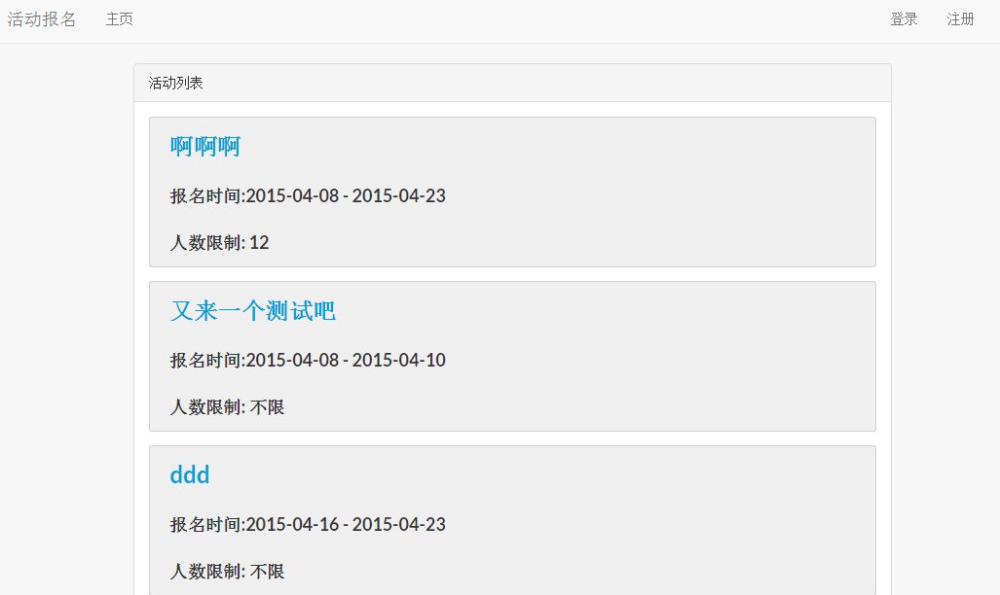
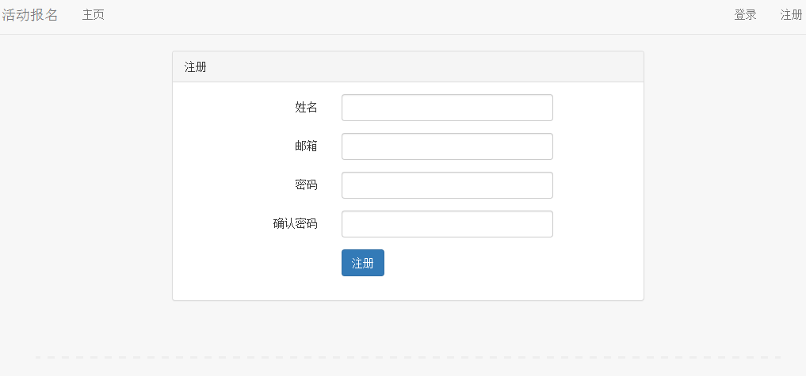
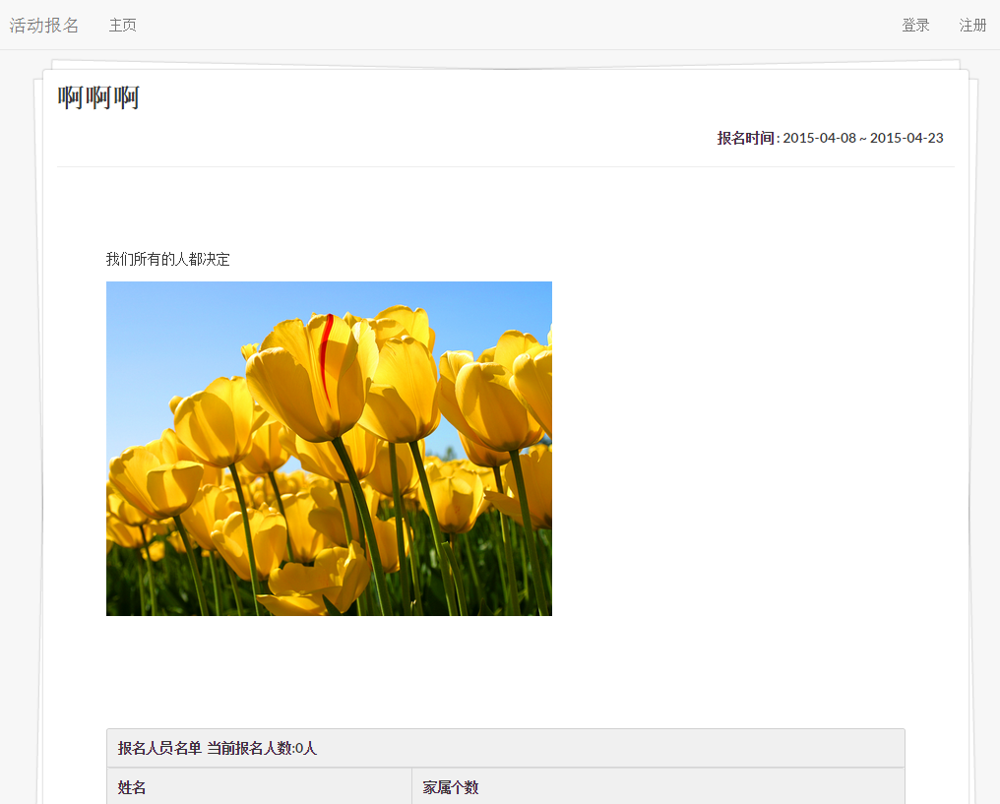
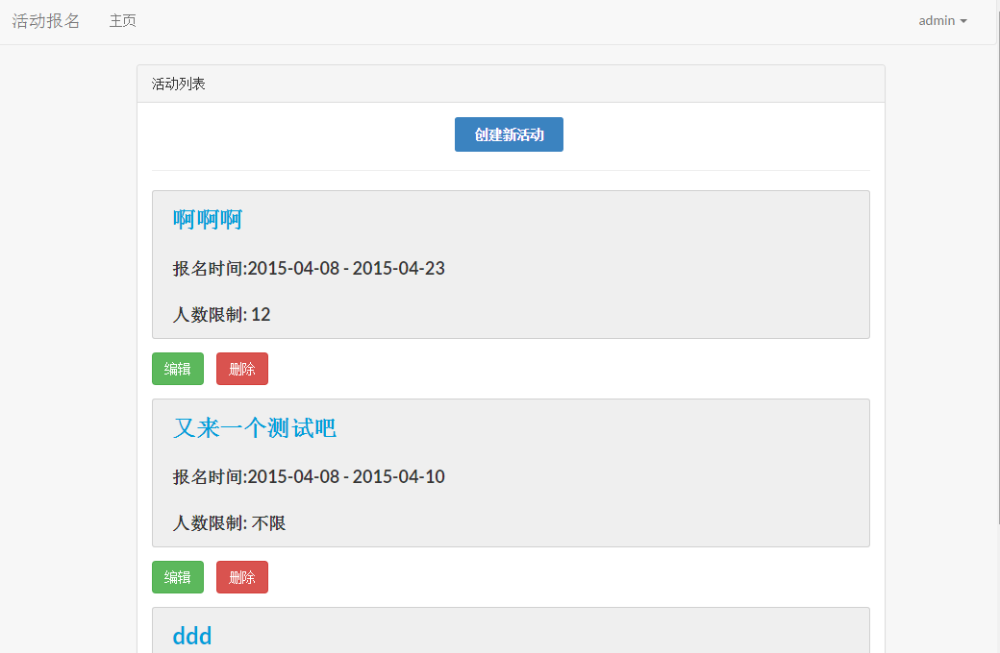
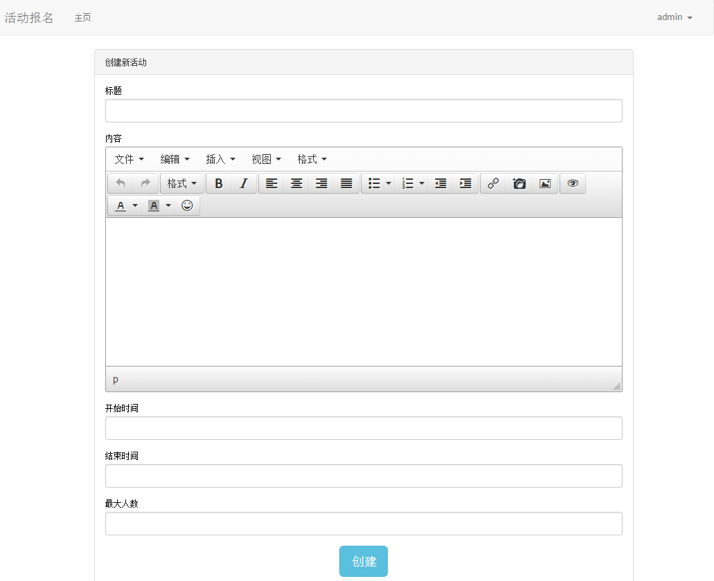

## 活动报名系统是基于laravel 5 开发
####运行环境
.Apache+mysql+php(可以下载集成环境，http://www.wampserver.com)
####如果是基于开发需求，需要最新的laravel框架，请安装
composer(参考http://www.phpcomposer.com/)
然后进行更新操作即可
####开始使用
1.配置.env文件  
2.运行服务器  
3.在服务器中创建配置文件中对应的数据库  
4.在代码根目录执行  
  php artisan migrate ---- 创建表  
  composer dump-autoload   
  php artisan db:seed  ---- 在数据库中写入默认的值(这里是管理员信息)  
####注意
配置的时候需要在Apache的配置文件httpd.conf中配置根目录到public下  
在线部署的时候，需要配置好.env,同时需要对数据库进行服务器ip授权访问  
在线部署出现找不到url的情况，检查是否将Apache的重写模块的开关打开  
####运行截图
#####index page

#####register page

#####activity detail page

#####admin index page

#####admin create page
